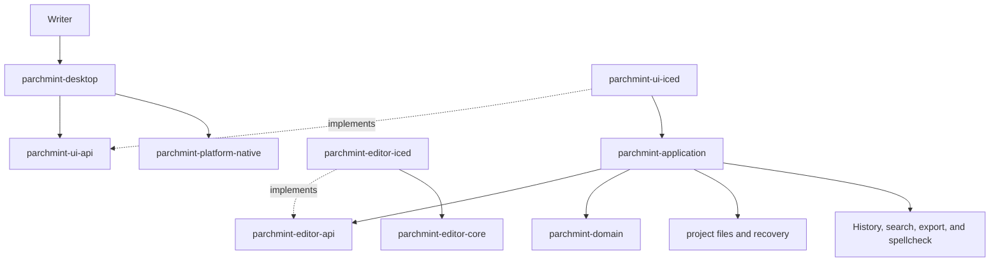

# ParchMint architecture

ParchMint is a native Rust desktop application for planning and writing novels.
`iced` provides its windows and application interface. The rest of the program
is split into small crates for writing, project files, History, search, export,
spellcheck, and operating-system work.

This page is the starting point for the architecture. Follow a crate link when
you need its public API or implementation details.

## How the application works



The desktop program starts the other crates and connects them. The UI displays
the project and sends user actions to the application crate. The application
checks each action, updates the project, and starts any required save, search,
History, or export work.

A normal edit and save looks like this:

```text
keyboard input
  -> editor changes its shared document session
  -> application receives the new document revision
  -> save crate captures that revision in a project snapshot
  -> filesystem crate safely replaces the project files
  -> History crate records the matching checkpoint
  -> UI shows the save result
```

File access, Git, SQLite, spellcheck, export, and whole-project analysis run
away from the UI loop. The UI continues handling input and redrawing while that
work runs. Each task sends its result back to the application when it finishes.

## Code structure

A crate ending in `-api` defines a ParchMint contract. It does not choose the
library that fulfills the contract. Indented entries implement that contract.
The indentation explains the relationship only; crate directories remain beside
one another in the workspace.

### Core writing model

- [`parchmint-domain`](../../crates/parchmint-domain/README.md) defines projects, documents,
  metadata, styles, comments, and commands.
- [`parchmint-application`](../../crates/parchmint-application/README.md) runs user actions
  and coordinates the other crates.
- [`parchmint-contracts`](../../crates/parchmint-contracts/README.md) defines durable JSON
  schemas for annotation sidecars, recovery records, and CLI machine output.

### Project files

- [`parchmint-project-format`](../../crates/parchmint-project-format/README.md) converts
  project values to and from deterministic files.
- [`parchmint-project-repository`](../../crates/parchmint-project-repository/README.md)
  defines how the application opens and reads a project.
  - [`parchmint-project-fs`](../../crates/parchmint-project-fs/README.md) implements that
    contract for a normal directory and replaces files safely.
- [`parchmint-save`](../../crates/parchmint-save/README.md) turns an in-memory snapshot into
  one completed save and History checkpoint.
- [`parchmint-recovery-api`](../../crates/parchmint-recovery-api/README.md) defines crash
  recovery storage.
  - [`parchmint-recovery-fs`](../../crates/parchmint-recovery-fs/README.md) stores recovery
    records on disk.

### Project services

- [`parchmint-history-api`](../../crates/parchmint-history-api/README.md) defines complete
  project checkpoints.
  - [`parchmint-history-git2`](../../crates/parchmint-history-git2/README.md) stores
    checkpoints with libgit2.
- [`parchmint-search-api`](../../crates/parchmint-search-api/README.md) defines project-wide
  search.
  - [`parchmint-search-sqlite`](../../crates/parchmint-search-sqlite/README.md) stores the
    search index in SQLite FTS5. ParchMint rebuilds this database from project
    files.
- [`parchmint-export-api`](../../crates/parchmint-export-api/README.md) defines whole-
  manuscript export.
  - [`parchmint-export-html`](../../crates/parchmint-export-html/README.md) creates the HTML
    export.
- [`parchmint-spellcheck-api`](../../crates/parchmint-spellcheck-api/README.md) defines
  offline en-US spellcheck.
  - [`parchmint-spellcheck-en-us`](../../crates/parchmint-spellcheck-en-us/README.md)
    implements that contract with a bundled offline dictionary and a private
    spelling engine.

### Desktop application

- [`parchmint-desktop`](../../crates/parchmint-desktop/README.md) starts the process and
  connects the crates.
- [`parchmint-ui-api`](../../crates/parchmint-ui-api/README.md) defines the contract for a
  desktop UI.
  - [`parchmint-ui-iced`](../../crates/parchmint-ui-iced/README.md) implements the desktop
    UI and owns the `iced` event loop and windows.
- [`parchmint-editor-api`](../../crates/parchmint-editor-api/README.md) defines what a
  rich-text editor provides.
  - [`parchmint-editor-iced`](../../crates/parchmint-editor-iced/README.md) implements that
    contract as a custom virtualized `iced` widget.
- [`parchmint-editor-core`](../../crates/parchmint-editor-core/README.md) supplies the
  framework-independent shared session used by the `iced` editor. It owns
  editor transactions, comments, undo, revisions, and canonical projection.
- [`parchmint-platform-api`](../../crates/parchmint-platform-api/README.md) defines the
  operating-system features ParchMint uses.
  - [`parchmint-platform-native`](../../crates/parchmint-platform-native/README.md)
    implements those features on Windows, macOS, and Linux.
- [`parchmint-design-system`](../../crates/parchmint-design-system/README.md) turns the
  Penpot design source into typed UI tokens and icons.
- [`parchmint-preferences`](../../crates/parchmint-preferences/README.md) stores application
  preferences and sends appearance changes to every window.
- [`parchmint-workspace-state`](../../crates/parchmint-workspace-state/README.md) restores
  the tabs, panes, scroll positions, and other workspace state for each project.

### Tools for development

- [`parchmint-core-cli`](../../crates/parchmint-core-cli/README.md) runs the real core
  without starting the desktop UI.
- [`parchmint-test-support`](../../tests/parchmint-test-support/README.md) provides shared
  fixtures, controlled tasks, and failure injection.
- [`parchmint-ui-verification`](../../tests/parchmint-ui-verification/README.md) decodes,
  compares, and reports framework-neutral PNG visual artifacts.

## Data and ownership

ParchMint saves each project as ordinary files. It stores search data,
crash-recovery data, open-editor state, and window state separately. The search
index can be rebuilt from the project files. Recovery data contains edits made
since the last completed save.

| Data | Location |
| --- | --- |
| Current project files | `project.toml` and the project-directory paths it lists |
| Project History | The app-managed Git repository at the project root |
| Recovery records | `.parchmint/recovery/` inside the project directory |
| Search and word-count caches | `.parchmint/cache/` inside the project directory |
| Tabs, panes, scroll positions, and window layout | The platform application-data directory, keyed by project ID |
| Appearance, global dictionary, and recent projects | The application preference file |

The current project files are the saved authored project. History keeps older
saved states. Recovery can contain newer unsaved edits. Cache and workspace
files are auxiliary application data and do not enter History.

The UI sends project changes to the application crate. The application checks
and applies them. Implementation crates keep their library-specific types to
themselves, including Git, SQLite, `iced`, editor-engine, and operating-system
types.

Each changing value has one owner:

- The application owns the current project structure, metadata, styles,
  deletion tombstones, project undo list, and project-wide replacement.
- An editor-core shared session owns an open document's content, comments,
  anchors, document undo list, revision, and logical selection and search state
  for each view.
- Each mounted `iced` view owns its viewport, pixel scroll position, focus, and
  block-layout cache.
- Project files hold the last completed save.
- History holds earlier project checkpoints.

Two panes that show the same document use the same session. They keep separate
selection and scroll state. The editor keeps text as valid UTF-8 and uses
ParchMint positions when it maps edits, comments, and selections. V1 supports
normal keyboard input for en-US writing. IME, bidirectional editing, broader
language support, and screen-reader integration remain extension work.
