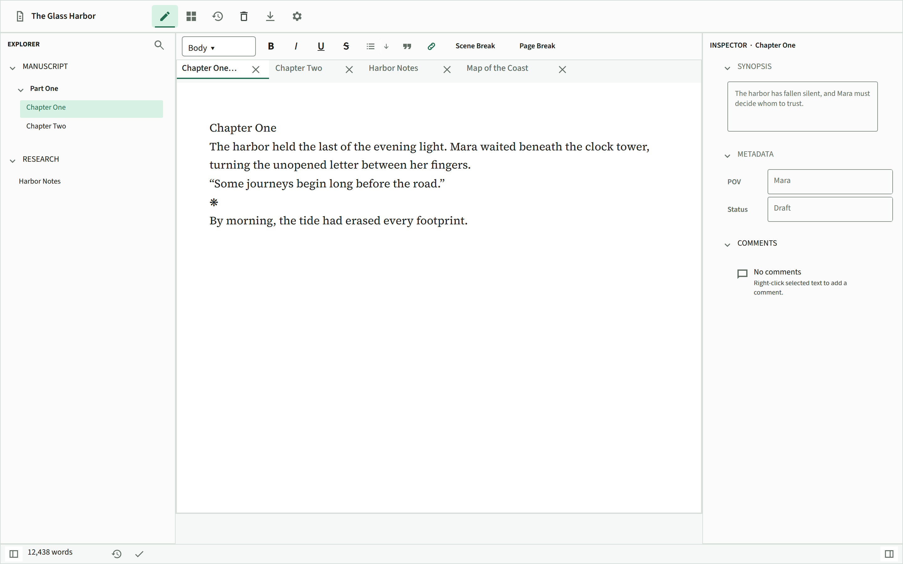
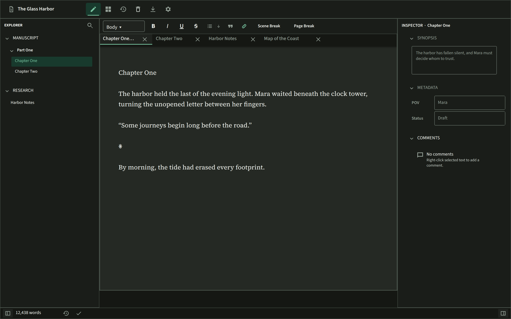
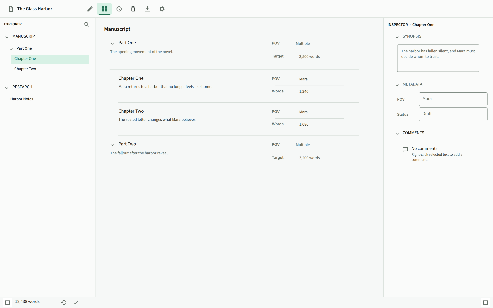
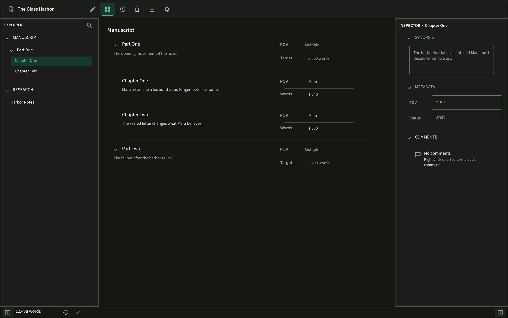
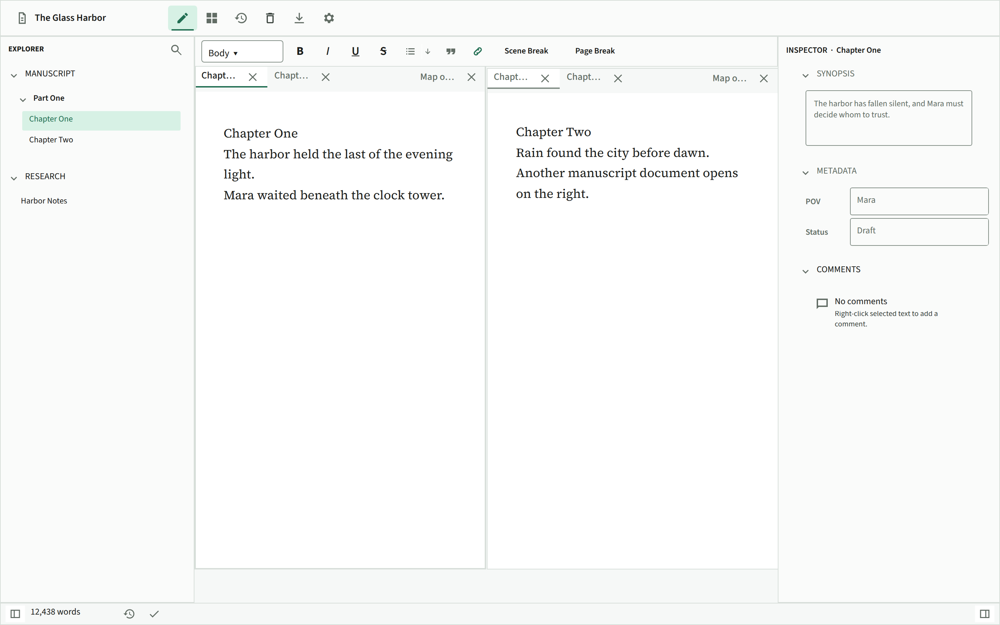
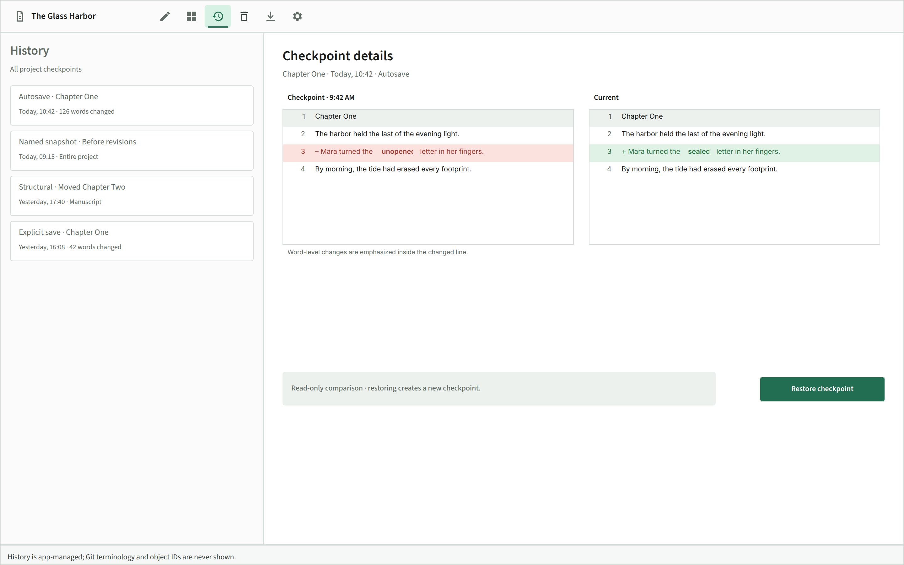
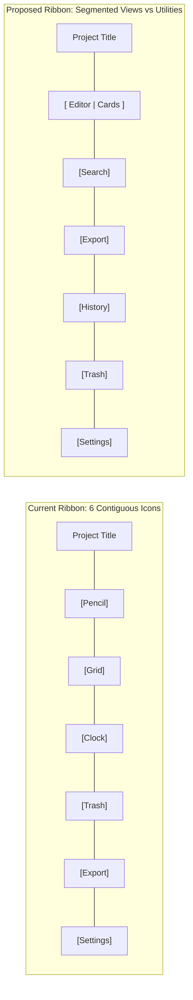

# ParchMint Novel Writing Application: Visual Design & UX Review Report

> **Status:** Sections 2–5 are the original, historical proposal set. Section
> 6 records the independent review; Section 7 records the subsequently
> approved product direction and supersedes it where they differ.

## Executive Summary

**ParchMint** is a local-first, distraction-free desktop writing application built for sustained novel drafting and structural planning. Its core philosophy—**"keep authored prose prominent and chrome quiet"**—is realized through restrained mint accents, compact desktop density, flat surfaces, and disciplined token architecture.

This report evaluates ParchMint's visual design, layout hierarchy, ergonomics, and component surfaces based on the v1 specification, Penpot design baselines, and implementation in `parchmint-design-system` and `parchmint-ui-iced`. It outlines key visual strengths, identifies ergonomic friction points, and provides a deep-dive design specification of proposed improvements, with primary focus on the **Tactile Cards Outliner Surface**, **Top Ribbon Navigation Architecture**, and **Editor Workspace Ergonomics**.

---

## 1. Visual Design Audit & Baseline Surfaces

````carousel

<!-- slide -->

<!-- slide -->

<!-- slide -->

<!-- slide -->

<!-- slide -->

````

### 1.1 Core Strengths
1. **Calm, Distraction-Free Chrome:** The UI chrome is unobtrusive, flat, and compact (52px top bar, 32px status bar), keeping the focus squarely on the manuscript prose.
2. **Distinctive Semantic Palette:** The botanical mint accent (`#2B6B55` / `#3B8266`) gives ParchMint an elegant, literary identity that sets it apart from typical generic blue software.
3. **Strict Domain Boundary:** Project prose formatting is strictly isolated from application chrome tokens, ensuring document portability and pristine exports.
4. **Instantaneous Interaction:** The zero-animation, high-efficiency interface provides immediate keyboard and pointer responsiveness.

---

## 2. Deep Dive: Tactile Cards Outliner Surface

The **Cards** view is ParchMint’s high-level planning and structuring surface. The product specification establishes clear invariants:
- **Strict 1D vertical hierarchy** (intentionally avoiding 2D multi-column corkboards to prevent horizontal scrolling fatigue and truncated synopses).
- **Read-only projection** (the Inspector remains the single editing surface for title, synopsis, and metadata).
- **Manuscript and Research support** with drag-and-drop reordering.

### 2.1 The Current Design & Observed Friction

In the current design (see [cards-light.png](tests/parchmint-ui-verification/references/penpot/light/cards-light.png)):
```text
Manuscript

v Part One                                     POV      Multiple
  The opening movement of the novel.           Target   3,500 words
-------------------------------------------------------------------
  Chapter One                                  POV      Mara
  Mara returns to a harbor that no longer...   Words    1,240
-------------------------------------------------------------------
  Chapter Two                                  POV      Mara
  The sealed letter changes what Mara...       Words    1,080
-------------------------------------------------------------------
```

#### Key Friction Points for Novelists:
1. **Lack of Visual Chunking (Common Region):**
   * Items are separated only by thin horizontal divider lines (`---`). In a full-length novel spanning 40–80 scenes, synopses, titles, and right-aligned metadata float in open white space.
   * Without a bounded container, the eye struggles to quickly group which synopsis and which metadata block belong to which chapter title.
2. **Low Metadata Glanceability (The "POV & Status Scanning" Problem):**
   * Metadata fields (`POV Mara`, `Status Draft`, `Target 3,500`) are rendered as plain monochrome text labels.
   * When an author wants to scan their novel to evaluate POV balance (e.g., checking if Mara has too many consecutive chapters vs Julian) or review drafting status (Draft vs Revised vs Final), they must read every single character string. In monochrome text, "Mara" and "Julian" look identical at a glance.
3. **Tactile Affordance for Drag & Drop:**
   * A flat text row separated by a rule visually signals "static text document." It does not convey that scenes are modular cards that can be picked up, reordered, or moved into another act.

---

### 2.2 Detailed Design Specification: Tactile Cards with Metadata Tag Pills

The proposed enhancement preserves all v1 invariants (1D vertical list, read-only projection, Inspector as editing source) while significantly elevating visual structure and glanceability.

#### Visual Comparison: Before vs. Proposed

```text
CURRENT FLAT LIST:
-------------------------------------------------------------------------------
  Chapter One                                       POV      Mara
  Mara returns to a harbor that no longer...        Words    1,240
-------------------------------------------------------------------------------

PROPOSED TACTILE CARD CONTAINER:
+-----------------------------------------------------------------------------+
|  Chapter One                                      [ POV: Mara ]  1,240 w   |
|  Mara returns to a harbor that no longer feels    [ Draft ]                 |
|  like home.                                                                 |
+-----------------------------------------------------------------------------+
```

---

### 2.3 Component Anatomy & State Variations

```text
+----------------------------------------------------------------------------------------------------+
| [v] Part One: The Crossing                                      (4 scenes · 5,820 / 7,500 words)   |
|     The opening movement across the bay.                                                           |
+----------------------------------------------------------------------------------------------------+
  |
  +-- [ CARD: Default State ]
  |   +----------------------------------------------------------------------------------------------+
  |   |  Chapter One: Harbor Light                         [ POV: Mara ]  [ Draft ]          1,240 w |
  |   |  Mara returns to a harbor that no longer feels like home. The clock tower bell               |
  |   |  is silent, and the dock master refuses to meet her eyes.                                    |
  |   +----------------------------------------------------------------------------------------------+
  |
  +-- [ CARD: Hover State (Subtle Accent Border) ]
  |   +----------------------------------------------------------------------------------------------+
  |   |  Chapter Two: The Sealed Letter                    [ POV: Mara ]  [ Revised ]        1,080 w |
  |   |  The wax seal carries a mark she has not seen in seven winters.                              |
  |   +----------------------------------------------------------------------------------------------+
  |
  +-- [ CARD: Selected State (Mint Selection Ring) ]
  |   +==============================================================================================+
  |   |  Chapter Three: Midnight Tide                      [ POV: Julian ]  [ Outline ]        850 w |
  |   |  Julian waits beneath the seawall with the lantern dimmed.                                   |
  |   +==============================================================================================+
  |
  +-- [ CARD: Dragging & Insertion Marker State ]
      ================================================================================================
      +----------------------------------------------------------------------------------------------+
      | (Ghost / 60% Opacity) Chapter Four: Departure      [ POV: Julian ]  [ Draft ]          940 w |
      +----------------------------------------------------------------------------------------------+
```

#### Detailed Breakdown of Card Features:

1. **Card Container Dimensions & Radii:**
   * **Border Radius:** `4.0px` (consistent with ParchMint standard radius).
   * **Border Stroke:** `1.0px` solid (`color.border.subtle`).
   * **Internal Padding:** `12px` vertical, `16px` horizontal.
   * **Card Gap:** `8px` vertical gap between sibling cards.
   * **Indentation Track:** `16px` left margin for child documents under a Group header, with a subtle vertical guide line connecting sibling cards.

2. **Semantic Metadata Tag Pills:**
   * **Geometry:** `border-radius: 12px`, padding `2px 8px`, typography `UI_COMPACT` (`12px` Source Sans 3).
   * **Color Roles:**
     * **POV Tags:** Muted tinted backgrounds with high-contrast text:
       * Mara: `#E2ECE9` background, `#1B4332` text (Light) / `#1C2E26` background, `#8FD1B5` text (Dark).
       * Julian: `#EDEAF5` background, `#3B2E58` text (Light) / `#2A2338` background, `#C4B5FD` text (Dark).
     * **Status Tags:**
       * Draft: `#FEF3E2` background, `#8A4B08` text (Light) / `#332312` background, `#FCD34D` text (Dark).
       * Revised: `#E8F4EC` background, `#22543D` text (Light) / `#162E20` background, `#86EFAC` text (Dark).
       * Final: `#E0F2FE` background, `#075985` text (Light) / `#102A3D` background, `#7DD3FC` text (Dark).

3. **Group Framing & Aggregates:**
   * Groups (`Part One`, `Part Two`) render as distinct structural headers:
     * Disclosure chevron (`v` / `>`) for instant expand/collapse.
     * Group title in `UI_HEADING` (`16px`, weight 600).
     * Right-aligned scene count and word target summary (`(4 scenes · 5,820 / 7,500 words)`).
     * Group synopsis displayed below title in muted secondary text.

4. **Keyboard & Drag-and-Drop Navigation:**
   * **Arrow Up / Down:** Move active focus between cards.
   * **Enter / Double-Click:** Switch to Editor workspace and open the focused document.
   * **Space:** Select/deselect card or expand/collapse group.
   * **Ctrl/Cmd + Arrow Up / Down:** Move card position within the hierarchy.
   * **Drag & Drop:** Shows a crisp 2px mint insertion line between cards and highlights the target group container when hovering over an act/part.

---

## 3. Workspace Shell & Navigation Refinements

### 3.1 Top Ribbon Navigation Architecture



* **The Problem:** The current ribbon places Editor, Cards, History, Recently Deleted, Export, and Settings in one identical row of icons. This conflates **Workspace Views** (how you write/plan) with **Utilities & Destinations** (History diffs, export dialogs, preferences).
* **The Proposal:**
  * Use a connected **Segmented Control** for `[ Editor | Cards ]` at the center-left.
  * Group utility actions (`Search`, `Export`, `History`, `Trash`, `Settings`) to the right with clear tooltips and consistent 36px touch targets.
  * This reinforces the user's mental model: they are either *Drafting* (Editor) or *Outlining* (Cards), while other tools are secondary destinations.

---

### 3.2 Inspector, Metadata & Comments Surface

1. **Comment Margin Connectors ("Margin Memory"):**
   * In-text comment highlights in the editor can feel disconnected from the comment cards in the right-hand Inspector.
   * Adding a subtle connecting indicator or matching tinted highlight in the editor margin anchors the comment visually to its source sentence.
2. **Collapsible Section Header Hierarchy:**
   * Currently, `SYNOPSIS`, `METADATA`, and `COMMENTS` use identical small uppercase text.
   * Adding count badges (e.g. `COMMENTS (3)`) and subtle background headers improves section discovery when collapsing and expanding.

---

### 3.3 History Checkpoints & Diff Visualization

1. **Unified/Inline Diff Mode Option:**
   * Side-by-side comparison works well on large desktop monitors, but in dual-pane mode or on smaller 13" laptop screens (1280×720), a toggle for an **inline unified diff** (showing deletions and additions in one column) provides superior reading comfort.
2. **Delta Badges on Checkpoint Rows:**
   * Displaying word delta chips (e.g. `+126 words`, `-42 words`) in the left history timeline allows authors to quickly pinpoint major drafting sessions versus minor typo corrections.

---

## 4. Prioritized Recommendations Matrix

| Item | Area | Description | Impact | Design Effort |
|---|---|---|---|---|
| **1. Tactile Cards with Metadata Pills** | Cards Outliner | Enclose scene cards in discrete containers with colored POV/Status pill badges, group headers, and guide tracks. | **High** | Medium |
| **2. Top Ribbon Reorganization** | Shell Navigation | Segment `[ Editor | Cards ]` workspace views separately from utility buttons (`Export`, `History`, `Settings`). | **High** | Low |
| **3. Active Document Breadcrumbs** | Editor Navigation | Show a subtle header trail (`Manuscript › Part One › Chapter One`) above the canvas to maintain spatial context when tabs truncate. | **Medium** | Low |
| **4. Comment Margin Connectors** | Inspector & Comments | Visually connect editor comment highlights to Inspector comment cards with subtle margin cues. | **Medium** | Medium |
| **5. Checkpoint Delta Badges & Unified Diff** | History Review | Add word count delta badges (`+126 w`) on checkpoint rows and an optional inline diff view toggle. | **Medium** | Medium |
| **6. Formatting Toolbar Button Normalization** | Editor Toolbar | Standardize button padding and replace text buttons (`Scene Break`, `Page Break`) with unified typographic glyph icons. | **Low** | Low |

---

## 5. Summary & Design Alignment

ParchMint possesses an exceptionally solid architectural foundation and a distinct, disciplined visual identity. The proposed refinements do not alter the underlying philosophy or expand scope into unwanted features; rather, they provide:
1. **Immediate visual chunking and scannability** in the Cards outliner for authors managing complex multi-chapter books.
2. **Clearer conceptual hierarchy** in the top ribbon navigation.
3. **Enhanced spatial orientation** and margin connectivity across the editor, history, and inspector surfaces.

---

## 6. Independent ParchMint review — August 2026

This report was reviewed against the maintained product and UI-design
authority, the current implementation, and the retained visual reference
boards. The proposals below are hypotheses from a static-design review, not
accepted requirements.

### Decisions

| Proposal | Decision | Reason |
| --- | --- | --- |
| Tactile Cards, tiles, coloured POV/status pills, and guide tracks | Rejected | Cards intentionally uses a compact, fixed-row, virtualized vertical outline with short separators rather than chips or tiles. Metadata is arbitrary, project-configured data, so hard-coded people/status palettes and implicit statuses would be misleading and colour-reliant. |
| New Cards keybindings | Deferred | Any keyboard refinement needs an end-to-end roving-focus, selection, virtual-scroll, drag-cancellation, and platform-shortcut design first. The existing drag destination already has visible text feedback as well as a mint marker. |
| Segmented Editor/Cards ribbon and Search in the ribbon | Rejected | Editor, Cards, History, Recently Deleted, Export, and Settings are intentionally one persistent, mutually exclusive destination control. Global Search belongs in the Explorer header. |
| Editor breadcrumbs | Deferred | Tabs and Explorer already provide document context; a permanent additional chrome row needs author-flow evidence, including two-pane and 1280 × 720 states. |
| Persistent comment-margin connectors | Rejected | They would be visually noisy and fragile across wrapping, sidebars, scrolling, and companion panes. Anchored highlights and the transient quote/comment hover card remain the intended connection. |
| Inspector section count | Deferred, narrowly scoped | If author testing demonstrates a discovery problem, plain secondary text such as `COMMENTS · 3 unresolved` may be considered. Filled header bands and ambiguous reply counts should not be added. |
| Unified History diff | Rejected | History intentionally compares checkpoint and current content side by side; it is a dedicated destination rather than a constrained editor pane. |
| Checkpoint word-delta chips | Deferred | The present history data does not define a trustworthy delta semantic or carry a stored value. Computing it per virtualized row risks history responsiveness. |
| Glyph-only Scene Break and Page Break commands | Rejected | These are unfamiliar structural authoring actions; their text labels are intentional discoverability cues. |

### Corrections to the original analysis

- The production accent tokens are `#216E52` (Light) and `#77C3A0` (Dark),
  not the values quoted above. Production UI uses semantic tokens, not
  hard-coded appearance-specific literals.
- `color.border.subtle` is not a current production token. Use the semantic
  border roles defined by the design system.
- The design authority says to avoid nonessential animation; it does not
  promise that the application has zero animation.
- The original report described flat Cards separation as a flaw. It is an
  intentional constraint that protects outline density and fixed-row
  virtualization.

### Action taken

The review uncovered a real interaction drift: the Cards documentation said a
group card expanded on one click, while a product sentence and implementation
still described double-click behavior. The resolved interaction is now
unambiguous: one click on a group Card selects and expands or collapses it;
one click on a document Card selects it, and a document double-click activates
it.

## 7. Approved refinement direction — August 2026

The product decisions below intentionally supersede the narrow rejections in
the independent review. They retain ParchMint's density and local-first
writing focus while making structure and document context easier to scan.

| Area | Approved direction |
| --- | --- |
| Cards metadata | Keep the fixed-height virtualized outline, but use compact bordered tiles. Render each configured field as a textual `Field: value` chip. Choose its subtle tint deterministically from the normalized field name and the active theme; colour never carries the meaning by itself. |
| Workspace navigation | Treat Editor and Cards as adjacent views over the same project data, using a compact labelled switch. Keep History, Recently Deleted, Export, and Settings as separate utility destinations. Search remains local to Explorer. |
| Context | Show a compact, non-interactive root-to-document breadcrumb independently above each populated Editor pane. Do not render it in the Global Search manuscript-only preview. |
| Comments | Keep anchored highlights and a transient hover popover rather than persistent margin connectors. The popover contains the attached quote/comment, dismisses when the pointer leaves the anchor/popover interaction, and clicking it reveals the matching Inspector thread without stealing editor focus. Inspector comments use a plain count/status summary rather than a filled section band. |
| History | Retain side-by-side comparison only. When already-loaded comparison data makes it inexpensive, surface a compact signed word-count change on checkpoint rows; do not add a unified mode or per-row loading. |
| Structural controls | Retain the discoverable `Scene Break` label, paired with a subtle divider glyph. Represent `Page Break` with the familiar page-break icon and a tooltip. |
